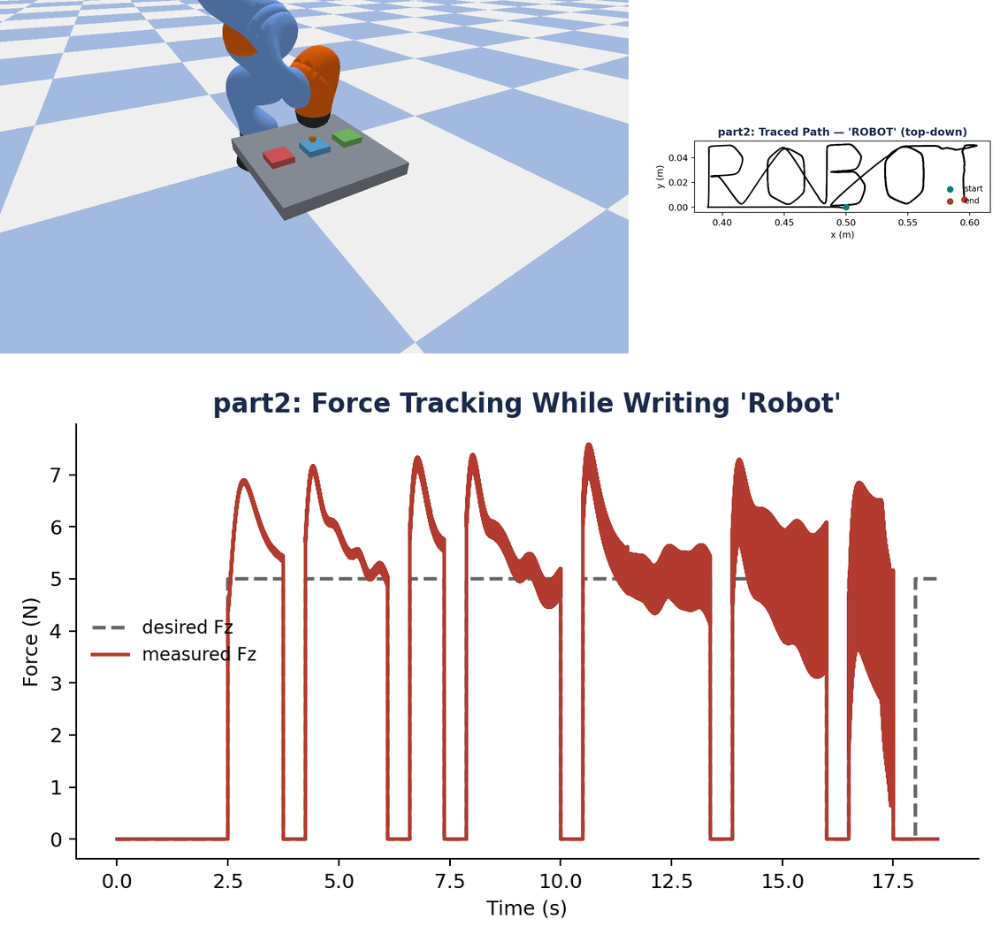
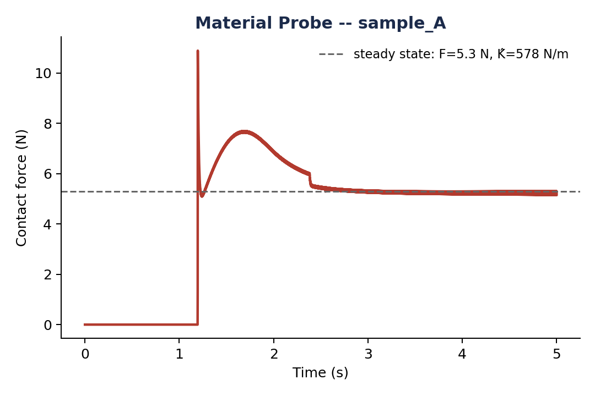

## Assignment 2: Force-Controlled Writing & Haptic Material Identification

## Overview:
The goal of this assignment is to implement and evaluate two fundamental force control strategies—Cartesian Impedance Control and Admittance Control—for a robotic manipulator in simulation. You will use these controllers to perform force-controlled writing and trace geometric patterns (acting like a compliant pen). Finally, you will perform haptic material identification (estimating the stiffness of unknown surfaces by pressing into them).

## Simulation Environment
The simulation environment is PyBullet, which provides realistic collision checking and kinematics utilities. The robot used is the KUKA iiwa 7-DoF arm with a spherical tool tip, interacting with a flat horizontal platform and material pads.

### Expected Output (What you need to achieve)

When your controllers and pattern generator are fully working, the robot will accurately trace the generated path on the surface while maintaining a precise 5N contact force. You need to create a live visualization dashboard. When you run the simulation with the `--live` flag, a window should pop up showing the desired trajectory vs. the actual trajectory in real-time, along with a live force-tracking graph. During material probing, it should plot the real-time loading curve (force vs. penetration depth). 

<p align="center">
  
</p>

<p align="center">
  
</p>

## Part A: Theoretical Foundation (Handwritten)
Before beginning the coding tasks, you must complete the following theoretical question. Scan your handwritten derivation and include it in your final `.zip` submission.

**Question 1: Impedance vs. Admittance Control Dynamics**
Consider a 1-DOF robotic manipulator tasked with pressing a tool into a stiff wall. The wall has an unknown stiffness $K_e$ and negligible damping, modeled as a pure spring $F_{meas} = K_e (x - x_w)$ for $x > x_w$, where $x_w$ is the wall position.

**(a)** State the standard dynamic control laws for both **Cartesian Impedance Control** and **Admittance Control**. 
**(b)** Draw the complete closed-loop block diagrams for both architectures in the Laplace domain. Clearly label the environment dynamics, the inner control loops (torque or position), and the feedback paths.
**(c)** For the **Admittance Control** architecture, assume the inner position loop is perfectly stiff ($x \approx x_c$). Derive the closed-loop transfer function relating the desired force $F_{des}(s)$ to the measured contact force $F_{meas}(s)$.
**(d)** Using your transfer function from (c), derive the analytical condition for the virtual damping $B_v$ that ensures the force response is **critically damped** upon contact. 
**(e)** Explain mathematically and physically what happens to the system's stability if the virtual mass $M_v$ is set too small. Why is this a notorious practical limitation when applying admittance control to highly stiff environments?

## Part B: Coding Exercises
The programming assignment contains 8 TODOs meant to be completed sequentially. Open `main.py` and search for the `TODO` comments.

*   **Part 1: Trajectory Generation**
    *   **TODO 1:** Write the code to generate the (x, y) coordinates for the shapes: **'circle', 'spiral', 'infinity', and 'heart'**.
*   **Part 2: Impedance Control Law & Writing**
    *   **TODO 2:** Write the math for the impedance controller to calculate the required joint torques, **AND** write the logic in the main loop to achieve the desired 5N contact force.
*   **Part 3: Admittance Writing**
    *   **TODO 3:** Write the code to update the admittance mass-damper system over time.
*   **Part 4: Analysis and Comparison**
    *   **TODO 4:** Calculate the error between the desired force and the actual measured force.
*   **Part 5: Haptic Material Identification**
    *   **TODO 5:** Calculate the stiffness of the unknown material by finding the slope of its force vs. depth data.
    *   **TODO 6:** Use that stiffness to classify the material as 'soft', 'medium', or 'hard'.
*   **Live Visualization**
    *   **TODO 7:** Create a live plotting window using `matplotlib` to show the robot's drawing and force in real-time.

### Optional Bonus: Cursive Writing & Complex Shapes
For extra credit, implement custom cursive writing styles and complex shapes by modifying the `generate_pattern` and `build_stroke_plan` logic. You can use parametric equations for cursive letters or load external trajectory data to trace more intricate designs.

## Setup & Running the Code

```bash
pip install -r requirements.txt
```

```bash
python main.py --part 1                      # Part 1: Trajectory generation
python main.py --part 3 --word Robot --live  # Run Impedance writing
python main.py --part 3 --word Robot --live  # Run Admittance writing
python main.py --part 4                      # Part 4: Comparison
python main.py --part 5 --live               # Part 5: Material ID
python main.py --part all --live             # Run all parts
```

## Submission Requirements
* Submit a single `.zip` file containing:
  1. Scanned handwritten answers for Part A (Block diagram, analysis, and critical damping derivation).
  2. Your completed `main.py` code (do not modify `utils.py`).
  3. All generated output figures from the `outputs/` folder (ensure these are generated using the default word **"Robot"** and pattern **"circle"**).
  4. A brief written report discussing the tracking performance (Part 5) and the series-compliance effect in material probing (Part 6). (5 Marks for report quality)

* **Grading Criteria:** Your code will be evaluated strictly on the basis of your **force tracking accuracy (Force RMSE)** compared to the 5N desired force, as well as the geometric accuracy and smoothness of the drawn trajectory. Make sure your controllers are properly tuned to minimize force overshoot and bouncing!

## References & Suggested Reading
1. **Hogan, N. (1985).** "Impedance control: An approach to manipulation." *ASME J. Dynamic Systems, Measurement, and Control*.
2. **Siciliano, B., & Villani, L. (1999).** *Robot Force Control*. Springer Science.
3. **Khatib, O. (1987).** "A unified approach for motion and force control of robot manipulators: The operational space formulation." *IEEE Journal of Robotics and Automation*.
4. **Ott, C. (2008).** *Cartesian Impedance Control of Redundant and Flexible-Joint Robots*. Springer Tracts in Advanced Robotics.
5. **Sun, Z., et al. (2014).** "A human-like robotic system for Chinese calligraphy." *IEEE Transactions on Systems, Man, and Cybernetics: Systems*.
